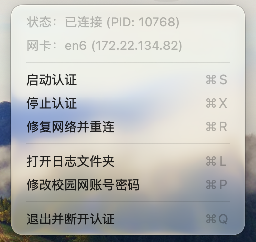

# RG For Mac

华南农业大学有线校园网的 macOS 802.1X 认证工具，替代锐捷（Ruijie/RG-SU）官方客户端，菜单栏点一下就能连。

> 目前只在华南农业大学验证过。其他学校即使也用锐捷，认证参数（`ServiceHex`、`VersionString` 等）大概率不一样，直接用大概率连不上，需要按下面"适配你自己的校园网"那节自己抓包对比、调整参数。

<p align="center"></p>

## 为什么做这个

学校用锐捷做有线网认证，而锐捷即将不再支持 Mac；现在能下载到的 Mac 版官方客户端本身还有个大问题——平均每 5 分钟就会断联一次，得手动重新认证。市面上有 [MiniEAP](https://github.com/updateing/minieap) 这样的开源 EAP 客户端实现了锐捷 v3/v4 协议，但只有命令行，日常用不方便——插错网口、密码存哪、断线要不要重连，这些都得自己管。

这个项目把 MiniEAP 包了一层 macOS 菜单栏 GUI：存密码、判断真实连接状态、断线自动重连，这些工程细节都在 App 里处理掉，只留一个"连接"按钮。

## 功能

- 菜单栏一键连接/断开，无需打开官方客户端
- 账号密码存 macOS 钥匙串，仅首次需要输入
- 自动检测可用有线网卡（USB 转以太网、Thunderbolt 扩展坞均可）
- 掉线后由认证进程自己重连，不再重复弹管理员授权框：服务器没响应（比如拔了网线）会一直重试；被服务器明确拒绝则每 25 秒重试一次，连续 10 次失败后才退出并提示
- 合盖睡眠唤醒后如果认证进程已经退出，会自动修复网络并重连
- 断开时向服务器发送标准 EAPOL-Logoff，不留下"僵尸会话"

## 架构

```
RGForMacApp/main.m   —— 菜单栏 GUI（Objective-C），负责账号密码、状态展示、启停调度
        │  以 "osascript ... with administrator privileges" 拉起/终止
        ▼
minieap-src/         —— 修改过的 MiniEAP（C），实际发 802.1X / EAPOL 帧、跑锐捷 v3 协议
```

GUI 进程本身不需要 root；真正收发以太网帧、需要裸抓包权限的是 `minieap` 子进程，每次启停都单独走一次系统的管理员授权。

## 使用

1. 编译并生成 App：
   ```bash
   cd RGForMacApp
   ./build.sh            # 加 --desktop 会顺手拷贝一份到桌面
   ```
   会在上一级目录生成 `RG For Mac.app`（arm64 + x86_64 通用二进制，macOS 12 及以上，Intel 和 Apple Silicon 的 Mac 都能用）。旧版本会挪到 `.build-trash/`，只保留最近 3 个。

   不想自己编译的话，GitHub Actions 每次推送都会构建一份，可以在 Actions 页面下载 `RG-For-Mac.zip`。

   这个 App 是 ad-hoc 签名（没有 Apple Developer 证书，也没做公证），第一次打开会被 Gatekeeper 拦下，提示"无法验证开发者"或者"已损坏，无法打开"。在 App 上右键选"打开"（而不是双击），或者去"系统设置 → 隐私与安全性"里找到提示、点"仍要打开"即可，只需要放行一次。

2. 打开 App，菜单栏会出现一个 "RG" 图标。点"连接"，第一次会弹窗让你输入校园网账号密码（保存进 macOS 钥匙串，之后不用再输）。

3. 认证过程需要 root 权限抓包/收发以太网帧，每次启动/停止都会弹系统的管理员密码/Touch ID 确认框。

点开菜单栏图标，最上面两行是只读状态：

- **状态**：未连接 / 正在认证中 / 已连接（连上时会带出 minieap 进程的 PID）。
- **网卡**：当前用来认证的网卡名和它拿到的 IP（没插网线或还没认证成功时不显示 IP）。

下面是可点的操作项：

- **启动认证**（⌘S）：开始连接。已经连着的时候这一项会变灰。
- **停止认证**（⌘X）：断开连接，会向服务器发送下线通知，同时关闭 minieap 进程。
- **修复网络并重连**（⌘R）：先给网卡重新走一遍 DHCP，再重新认证；网线换了个口、或者 DHCP 卡住导致有 802.1X 但没 IP 时用这个，比单纯"停止再启动"更彻底。
- **打开日志文件夹**（⌘L）：在 Finder 里打开 `~/Library/Logs/RGForMac/`，认证失败时里面能看到服务器返回的具体原因。
- **修改校园网账号密码**（⌘P）：重新弹一次账号密码输入框，覆盖钥匙串里存的旧值。
- **退出并断开认证**（⌘Q）：断开连接并退出 App，和直接叉掉菜单栏图标效果一样，会先确保 minieap 也一起关掉，不会留下断了 App 但认证进程还在跑的情况。

## 适配你自己的校园网

`RGForMacApp/main.m` 里的这几个常量大概率需要按你自己学校的情况调整：

- `ServiceHex`：`--rj-option` 里的服务名字段（当前值解码是"有线1x上网"），一般是通用值，不涉及个人信息。
- `VersionString`：伪装的官方客户端版本号，不同学校服务器可能要求不同版本才放行。
- 认证失败时看日志（菜单栏"打开日志文件夹"），MiniEAP 会打印服务器返回的具体拒绝原因，照着调整参数。

## 已知限制

- 每次连接/断开都要走 `osascript ... with administrator privileges` 弹管理员授权框，做不到完全静默（掉线重连在认证进程内部完成，不会再弹）。密码通过 `~/Library/Application Support/RGForMac/` 下一个仅本人可读（0600）的临时文件交给 root 脚本，读完立即删除，不会出现在任何进程的命令行参数里。
- 断开连接依赖 macOS 对 `SIGINT`/`SIGTERM` 的正常传递；个别系统环境下可能会退化成强制杀进程（不影响功能，只是不会给服务器发优雅下线通知）。

## Credits

- 认证核心基于 [MiniEAP](https://github.com/updateing/minieap)（作者 updateing@HUST），遵循 GPLv3，见 [`minieap-src/LICENSE`](minieap-src/LICENSE)。
- 锐捷 v3/v4 认证算法来自 [Hu Yunrui 的 MentoHUST 项目](https://github.com/hyrathb/mentohust)。
- 本仓库其余部分（`RGForMacApp/` 菜单栏客户端）同样以 GPLv3 发布，见根目录 [`LICENSE`](LICENSE)。
